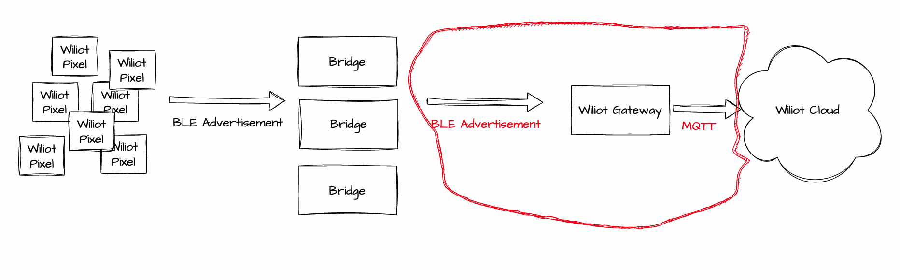

# Wiliot Gateway Integration Guide


* * * * *

## Introduction


This guide provides a comprehensive overview of integrating with the Wiliot Gateway, tailored for Software/Firmware engineers. The primary focus is on Wiliot pixel data ingestion, excluding instructions on using the Wiliot platform to obtain data.

#### Key Requirements:

-   Ability to receive BLE Advertisement packets (BLE Scan).
-   MQTT communication channel directed towards the Wiliot cloud.

* * * * *

Table of Contents
-----------------

1.  [Understanding the System](#understanding-the-system)
2.  [Prerequisites](#prerequisites)
3.  [Setting Up Your Gateway](#setting-up-your-gateway)
4.  [Uploading Data & Configuration](#uploading-data-&-configuration)
5.  [Platform Management](#platform-management)
6.  [Appendix](#appendix)

* * * * *

## Understanding the System

The Wiliot platform operates using a synergistic arrangement of IoT Pixels, Bridges, and Gateways. Understanding the interplay between these components is vital for effective integration. 



Here's a breakdown of how they operate:


### IoT Pixels:

IoT Pixels, often referred to simply as 'Pixels', are battery-free devices that harvest energy from ambient radio waves. These Pixels serve as data gatherers and have two primary tasks:

1.  **Energy Harvesting**: Pixels power themselves by absorbing surrounding radio waves, eliminating the need for batteries.

2.  **Data Broadcasting**: Once powered, Pixels transmit their unique encrypted ID and environmental sensor data using standard BLE (Bluetooth Low Energy) advertising packets.

### Bridges:

Bridges are intermediaries that play two crucial roles in the Wiliot ecosystem:

1.  **Energizing Pixels**: They emit the necessary energy for Pixels to operate, allowing the latter to remain battery-free.

2.  **Amplifying Data**: After Pixels broadcast their data, Bridges receive this information and retransmit it with a stronger signal. This enhances the data's range, allowing it to be captured by distant gateways. Additionally, Bridges are pivotal for location tracking. A Pixel's proximity to specific bridges helps determine its location within a designated zone.

### Gateways:

Gateways are the communication nodes that connect the local Wiliot system to the Wiliot Cloud:

1.  **Receiving Data**: A gateway captures the data amplified by Bridges. Typically, a gateway can receive data from a bridge that's up to 100 meters away.

2.  **Uploading to the Cloud**: After receiving the data, the gateway then relays this information to the Wiliot Cloud. This is where the data gets decrypted, processed, and translated into meaningful insights using advanced machine learning algorithms.

By integrating your device to function as a Wiliot Gateway, you'll be enhancing its capabilities to tap into this rich ecosystem, gathering invaluable data and insights from the Wiliot platform.

* * * * *

## Prerequisites


Before diving into integration, ensure you've set the foundational elements:

1.  [Create Developer Account](https://support.wiliot.com/hc/en-us/articles/10331376472083-Cloud-Platform-Account-Management)

2.  [Obtain API Security Key](https://support.wiliot.com/hc/en-us/articles/360051046433-Wiliot-API-Authentication)

3.  [Fetch Access & Refresh Tokens](authentication-overview.md):


* * * * *

## Setting Up Your Gateway

The steps detailed below will walk you through the process of setting up your gateway:

### Step 1: Registering Your Gateway:

Every gateway needs to be registered with the Wiliot platform to be recognized and to function correctly. Registering the gateway provides it with a unique identity, allowing for secure communication with the Wiliot Cloud.


```json http
{
  "method": "post",
  "url": "https://api.wiliot.com/v1/owner/{ownerId}/gateway/{gatewayId}/mobile",
  "headers": {
    "Content-Type": "application/json",
    "Accept": "application/json",
    "Authorization": "Bearer <Your Access Token>"
  },
  "body": {
    "gatewayType": "other",
    "gatewayName": "gateway_name"
  }
}
```
### Step 2: Managing Tokens:
Tokens are crucial for ensuring the security of communication between your gateway and the Wiliot Cloud. You will receive an access token and a refresh token upon registering your gateway. The access token is used to authenticate your gateway for data transmission, while the refresh token is used to obtain a new access token once the current one expires.

#### Fetching Access Tokens: 

```json http
{
  "method": "post",
  "url": "https://api.wiliot.com/v1/auth/token/api",
  "headers": {
    "Content-Type": "application/json",
    "Accept": "application/json",
    "Authorization": "<Edge Management API security key>"
  },
}
```

Remember, tokens come with an expiration date. Make sure to refresh them before they expire to maintain a seamless interaction with the cloud.

#### Token Refreshing:

```json http
{
  "method": "post",
  "url": "https://api.wiliot.com/v1/gateway/refresh",
  "query": {
    "refresh_token": "<Your Refresh Token>"
  }
}
```

Remember to replace placeholder values `<ownerId>`, `<gatewayId>`, `<Your Access Token>`, and `<Your Refresh Token>` with the appropriate values from your setup.

* * * * *

### Step 3: Data Handling and Configuration

Now, with your gateway set up and tokens in place, you can move onto the main functionality:

#### Uploading Data & Configuration


-   Scan for Wiliot BLE packets.  Use 16b-UUID 0xFDAF to identify Wiliot Pixel packets or 16b-UUID 0xFCC6 to identify Wiliot Bridge packets. Consult this [reference page](https://support.wiliot.com/hc/en-us/articles/360025587633-IoT-Pixel-Ephemeral-ID-Format-Details).

-   Connect to the Wiliot MQTT Endpoint and structure your MQTT packets as per [this guide](https://support.wiliot.com/hc/en-us/articles/4411107792531).

* * * * *

## Platform Management


Navigate and control the Wiliot system using the [Wiliot platform](https://platform.wiliot.com/). Learn to manage your gateways on the platform [here](/docs/Getting-Started/Managing-and-Monitoring-Gateways-with-the-Wiliot-Platform.md)

* * * * *

## Appendix


-   [Detailed Bridge Operations](docs/Bridges/Bridge-Operations.md)

-   Downloads:

    -   [Wiliot-IoT-Pixel-V2-Dual-Band-Data-Sheet](https://support.wiliot.com/hc/en-us/articles/4408214014867-Wiliot-IoT-Pixel-V2-Dual-Band-Data-Sheet)
    -   [Wiliot-IoT-Pixel-V2-Single-Band-Data-Sheet](https://support.wiliot.com/hc/en-us/articles/4403387470483-Wiliot-IoT-Pixel-V2-Single-Band-Data-Sheet)
